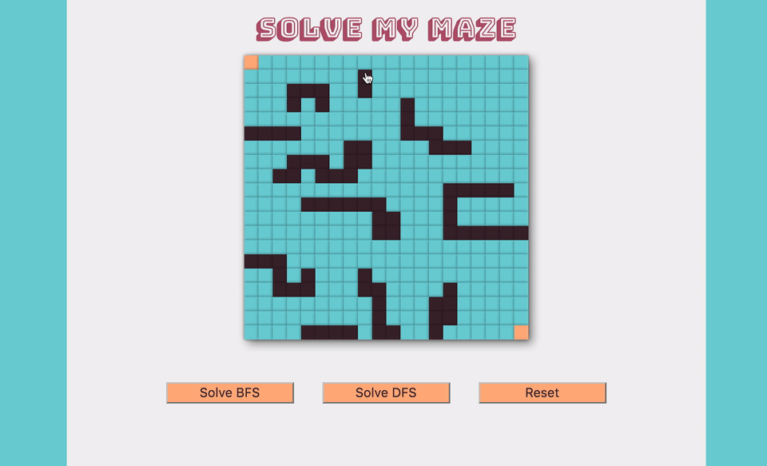

# Solve My Maze [live_link]
[live_link]: https://brentluna.github.io/maze_solver/

## Background

Inspired by my fascination with Breadth First Search and it's ability to find the shortest path.




## Goal

Design your maze by dragging the mouse across cells of the grid. Once designed, you can choose whether you want an iterative Breadth First search or recursive Depth First Search to solve the maze.

## Solving Logic

The maze cells change color as the algorithm checks them, so you can see how the algorithm approaches solving the maze. It then draws the path that it discovered to get from start to finish. When choosing breadth first, it will always choose the shortest path possible.


```javascript

  dfs(e, start = [0, 0]) {
    const that = this;
    if (that.dfsCheckPos(start)) {
      return true;
    }
    let children = that.findChildren(start);
    children.forEach(child => {
      let result = that.dfs(1,child);
      if (result) {
        that.traceDFS();
        return result;
      } else {
        return false;
      }
    });
    return false;
  }


  bfs(e) {
    e.preventDefault();
    if (!this.state.solving) {
      this.setState({solving: true});
      let queue = [[0, 0]];

      let solveInterval = setInterval(() => {
        if (this.unsolved && queue.length) {
          let parent = queue.shift();
          let newChildren = this.findChildren(parent);
          queue.push(...newChildren);
          this.checkPos(parent);
        } else {
          clearInterval(solveInterval);
          this.findShortestPath();
        }
      }, 30);
    }
  }

```

## Future Directions

- Add additional algorithms, such as Best First Search
- Add option to select start and end points
- Add selector for solving speed animation
